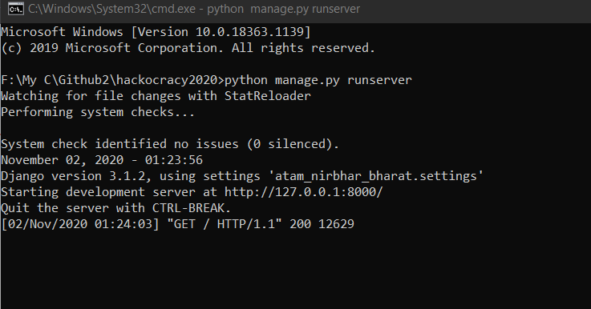
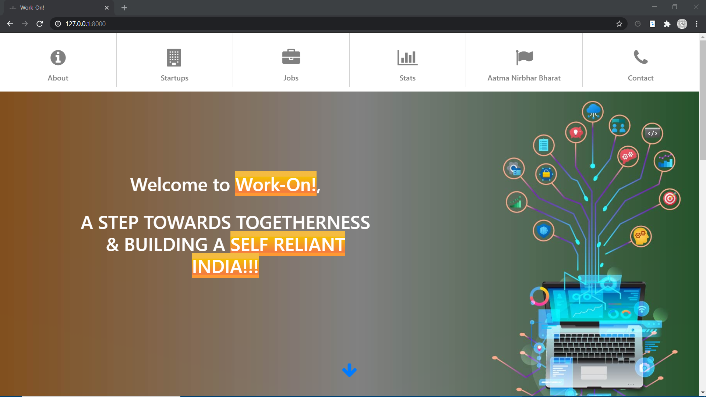
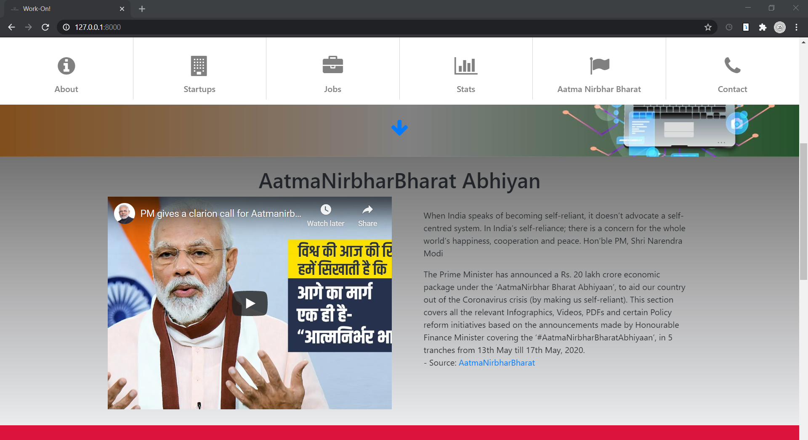
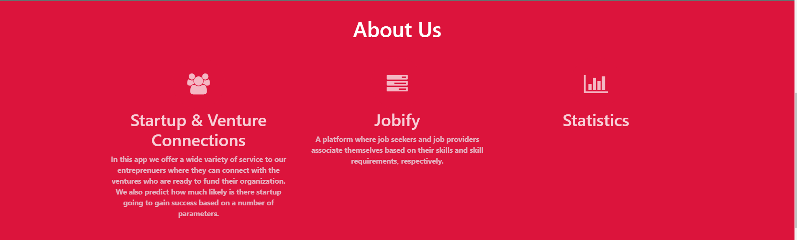
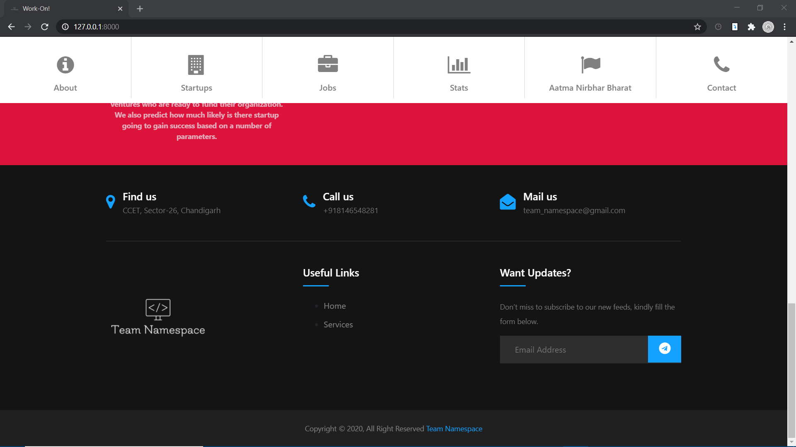
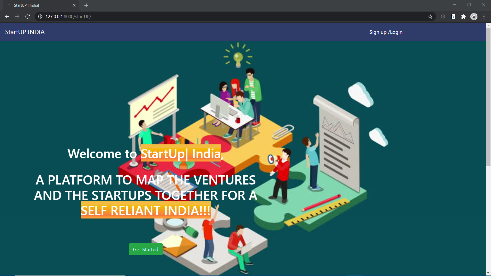
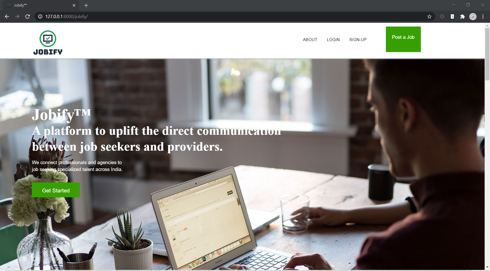
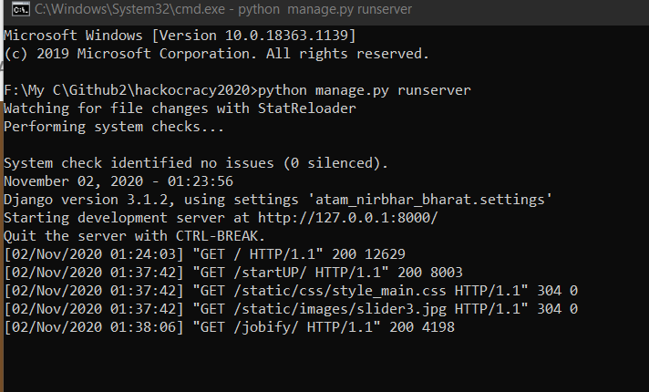

# #hackocracy2020 | WorkOn-Savor the flavor of Work!
## Project Description
In order to accomplish the dream of our honourable Prime Minister Shri. Narendra Modi to make India Self Reliant, we present to you an innovative solution to first reduce the gap between the startups and the funders through our app StartUp India. Secondly, we will let people apply for jobs as well, through another platform called Jobify. Further, using regressive data analysis we bring out to the government to make them aware about the investments, skills and need of the present market. These will not only help to promote the development of Entreprenuers but also help individuals attain the jobs even during tough times.     
    Module 1:  
         Startup & Funders: 
             a) Startups will get registered. 
             b) Interested Funders will get registered. 
             c) Startups will post their products and get a list of relevant funders based on their product properties. 
             d) Funders can also view the list of product in which they may be interested. 
             e) Funders and Startups will get to know the score of product predicted by our Deep Learning Model. 
    Module 2: 
          Jobify: 
              a) Job seekers will get registered with their specific Job profiles. 
              b) Various Companies and Startups can get themselves registered. 
              c) Companies can post the jobs for relevant profiles they need. 
              d) Job seekers will get the list of available jobs based on their profile and filters. 
              e) Interested Job seeker can directly apply to given details by the company through an email. 
              f) Company can inform about their selection procedure if they feel the profile suits them. 
   Module 3: 
          Statistics & Data Analysis: 
              a) Based on Number of Startups in a particular domain, we can get the percentage of jobs in the respective domain.  
              b) Based on Ratio of Startups and Funders in respective domains, we can let the government know where we need foreign investment. 
              c) Based on Data Analysis and Deep Learning Models, we can predict the trend of future technologies in the market.       
## Prerequisites:
Python should be installed on your system. 
## To run the project at your local machine, follow the below given steps:
*Clone/ Download the repository to your system.* 
*Make sure your system is installed with django if not run the following command from your command prompt* 
<code>pip install django</code> 
*In the same directory, where your project is open command promp and run:* 
<code>python manage.py runserver</code> 
## Outputs
After running the above command a screen like below will be seen: 
 
Now go to your browser and open the local host to have access to the project. A few of the screens of the project are shown below: 
*Home Screen --> WorkOn* 
 
 
 
 
*Home Screen --> StartUp | India* 
 
*Home Screen --> Jobify* 
 
*Status of App can also be viewed locally:* 
 
